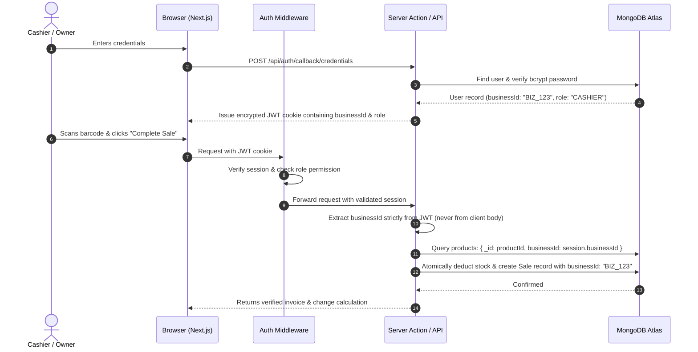

# 🏗️ Sri Lanka Small Business POS — Phase 1: System Architecture

This document defines the technical structure, security boundaries, and data flow patterns for the Sri Lanka POS system.

---

## 1. Project Directory Structure

We use the modern **Next.js App Router** with TypeScript and Tailwind CSS, keeping concerns strictly separated:

```
corner-store-pos/
├── docs/                      # Requirements and Architectural documentation
│   ├── REQUIREMENTS_V1.md
│   └── ARCHITECTURE.md
├── public/                    # Static assets (logos, receipt template sample, sound effects)
├── src/
│   ├── app/                   # Next.js App Router (Pages & API routes)
│   │   ├── (auth)/            # Authentication route group (Login, Register Shop)
│   │   │   ├── login/
│   │   │   └── register/
│   │   ├── (dashboard)/       # Protected shop application routes
│   │   │   ├── dashboard/     # Owner / Manager overview
│   │   │   ├── pos/           # High-speed Cashier POS screen
│   │   │   ├── products/      # Catalog, pricing, barcodes, categories
│   │   │   ├── inventory/     # Stock count, adjustments, low stock alerts
│   │   │   ├── sales/         # Invoices, transaction history, thermal reprint
│   │   │   ├── customers/     # Customer phone directory & history
│   │   │   ├── reports/       # Daily sales, payment methods, profit estimates
│   │   │   └── settings/      # Shop info, LKR currency, tax rates, receipt config
│   │   ├── api/               # Secure server endpoints (NextAuth, webhooks, exports)
│   │   │   └── auth/
│   │   ├── layout.tsx         # Global root layout
│   │   └── page.tsx           # Landing / redirect to POS or Dashboard
│   ├── components/            # Reusable UI components
│   │   ├── ui/                # Base primitives (Button, Input, Modal, Table, Badge, Card)
│   │   ├── pos/               # POS screen widgets (ProductGrid, CartItem, PaymentModal)
│   │   ├── layout/            # Navigation (Sidebar, TopNav, MobileNav)
│   │   └── receipts/          # Thermal receipt preview and printable view (58mm/80mm)
│   ├── lib/                   # Shared backend & frontend utilities
│   │   ├── db.ts              # MongoDB connection pool singleton (Mongoose)
│   │   ├── auth.ts            # NextAuth options, session helpers & password hashing
│   │   ├── tenant.ts          # Multi-tenant security filters and query wrappers
│   │   ├── formatters.ts      # Sri Lankan Rupee (Rs.) and date/time formatters
│   │   ├── validations/       # Zod schemas (Product, Sale, Customer, Settings, Auth)
│   │   └── i18n/              # Translation loader (en, si, ta)
│   ├── locales/               # Language dictionaries
│   │   ├── en.json            # English strings (Default)
│   │   ├── si.json            # Sinhala translation placeholders
│   │   └── ta.json            # Tamil translation placeholders
│   ├── models/                # MongoDB Mongoose database models
│   │   ├── Business.ts        # Shop profile, currency, tax rules, receipt header
│   │   ├── User.ts            # Credentials, role, business reference
│   │   ├── Category.ts        # Product categories
│   │   ├── Product.ts         # Items, barcodes, pricing, stock levels
│   │   ├── InventoryLog.ts    # Stock movement audit history
│   │   ├── Sale.ts            # Orders, line items snapshot, payments, change
│   │   ├── Customer.ts        # Customer records
│   │   └── AuditLog.ts        # System audit trail
│   └── types/                 # TypeScript type definitions
│       ├── next-auth.d.ts     # Extended session types (with businessId and role)
│       └── index.ts           # Global application types
├── .env.example               # Template of required environment variables
├── next.config.mjs            # Next.js configuration
├── tailwind.config.ts         # Tailwind styling setup
├── tsconfig.json              # TypeScript compiler configuration
└── package.json               # Dependencies and build scripts
```

---

## 2. Multi-Tenant Security Flow (Zero Data Leaks)

The most critical architectural requirement is that **Business A must never access or see Business B's data under any circumstance**.



### Key Security Safeguards:
1. **Never Trust Client-Submitted IDs**: The client cannot send a `businessId` in a form or request body. The server always extracts it from the cryptographically signed session token.
2. **Compound Database Indexes**: Every query filters by `{ businessId, ... }`. Indexes on `{ businessId: 1, barcode: 1 }` ensure instant lookups and physical index-level isolation.
3. **Price Calculation Integrity**: Cart item prices submitted by the browser are treated as untrusted hints. The server looks up current selling prices from the database to compute the final subtotal, tax, and total.

---

## 3. Server-Side Validation Pipeline (Zod)

Every piece of incoming data is validated using **Zod** before hitting database logic.

* **Product Schema**: Validates name, cost price (>= 0), selling price (>= cost price recommendation), stock quantity (integer), and SKU/barcode uniqueness per business.
* **Sale Schema**: Validates payment method, received cash (must be >= total if payment method is CASH), customer ID (optional), and cart line items.
* **Phone Schema**: Validates Sri Lankan mobile (`07XXXXXXXX` / `+947XXXXXXXX`) or landline patterns.

---

## 4. Thermal Printing Architecture

Thermal receipt printers in Sri Lankan shops (e.g. standard Epson, Xprinter, POS-58, POS-80) accept standard print commands or print preview windows from browsers.

* **CSS Print Style Sheets**: Uses `@media print` rules with explicit CSS `@page { size: 58mm auto; margin: 0; }` and `80mm` variants.
* **Optimized Font & Layout**: Monospaced tabular alignment (`font-mono`) ensuring numbers and decimals align cleanly on narrow thermal paper rolls.
* **No Cloud Latency**: Receipts are rendered directly on the device using native browser printing, triggering immediate printing via USB or local network printers.

---

## 5. Offline & Unstable Internet Strategy (Resilience)

While full offline database sync is reserved for later phases, V1 introduces **Network Resilience**:
1. **Lightweight Requests**: API payloads are compressed and stripped of unnecessary bloat.
2. **Debounced & Cached Lookups**: Common products and categories are held in local React memory while the POS screen remains open.
3. **Clear Network Status Toast**: If an internet fluctuation occurs while completing a sale, the UI immediately alerts the cashier with a clear retry prompt and **never silently loses the transaction**.
